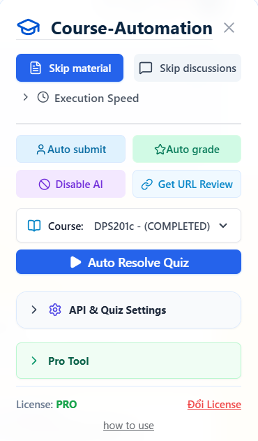
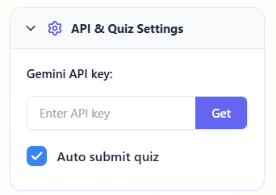
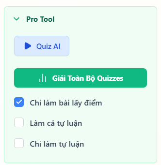
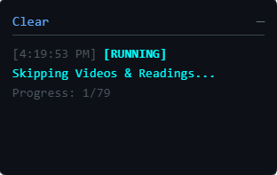

# Coursera Automation Extension

- [Bảng Giá Key](#bảng-giá-key)
- [Giao Diện Tool](#giao-diện-tool)
- [Hướng Dẫn Chạy](#hướng-dẫn-chạy)
- [Hướng Dẫn Sử Dụng](#hướng-dẫn-sử-dụng)

---

## BẢNG GIÁ KEY

  

## Giao Diện Tool

  <table>
    <tr>
      <td align="center">
        <b>Giao diện chính</b> 
         
        
      </td>
      <td align="center">
        <b>Nhập Key</b> 
         
        
      </td>
    </tr>
    <tr>
      <td align="center">
        <b>Cài đặt và nhập API</b> 
         
        
      </td>
      <td align="center">
        <b>Tính năng PRO</b> 
         
        
      </td>
    </tr>
    <tr>
      <td align="center" colspan="2">
        <b>Terminal log thông báo</b> 
         
        
      </td>
    </tr>
  </table>

## Hướng Dẫn Chạy

1. Load Extension vào Chrome:
   - Mở Chrome, truy cập `chrome://extensions/`
   - Bật **Developer mode**
   - Chọn **Load unpacked**
   - Trỏ tới thư mục `build/`.

---

## Hướng Dẫn Sử Dụng

Sau khi cài đặt thành công Extension vào trình duyệt, bạn làm theo các bước sau để sử dụng:

1. **Truy cập Coursera**: Mở trang web Coursera và đăng nhập vào tài khoản của bạn.

2. **Mở Bảng Điều Khiển**: Truy cập vào một khóa học bất kỳ mà bạn muốn học. Nhấn vào chữ menu (nằm ở góc trên bên phải) để mở bảng điều khiển chính.

3. **Kích hoạt Bản Quyền**: Điền mã bản quyền của bạn để kích hoạt các chức năng nâng cao (PRO) hoặc nhấn vào mua key nếu chưa có.

4. **Cấu Hình AI (Tuỳ chọn)**: Nếu bạn muốn sử dụng tính năng AI giải thích đáp án hoặc chấm điểm tự luận, hãy vào mục "Setting và nhập API" để dán cấu hình khóa API (API Key) của bạn vào.

5. **Khởi Chạy Tự Động Hóa**: Quay lại màn hình chính của công cụ, chọn tính năng bạn muốn (như Skip Video, Giải nhanh Quiz) và nhấn nút bắt đầu.

6. **Theo Dõi Tiến Trình**: Bạn không cần thao tác thêm, chỉ việc quan sát Terminal Log bên trong ứng dụng để biết tool đang làm gì và khi nào hoàn thành.
